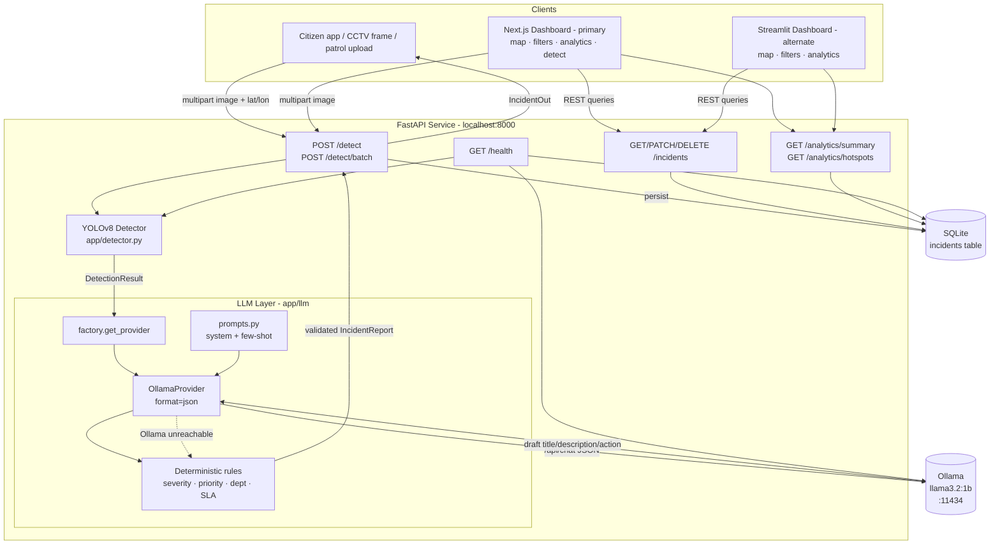
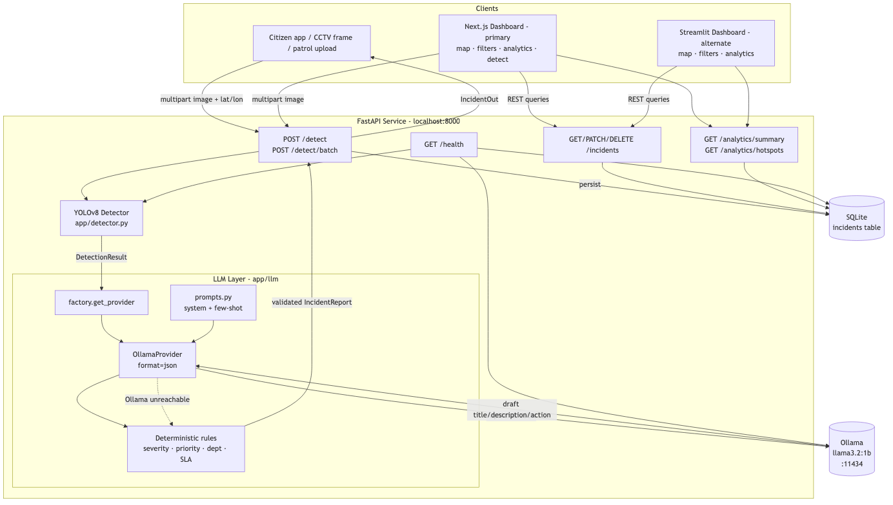

# Architecture

This document describes the full pipeline for the Smart City illegal garbage
dumping detection system: how an image flows from upload to a stored,
map-visualized incident.

## Pipeline diagram

> The API enables CORS (all origins) and mounts uploaded detection images as
> static files under `/uploads`, so browser clients (the Next.js dashboard) can
> call the API cross-origin and render stored images directly.

A rendered PNG of the diagram above (for viewers that don't render Mermaid):

> Regenerate with: `mmdc -i docs/architecture.mmd -o docs/architecture.png -b white -w 1400`
> (the Mermaid source is extracted to `docs/architecture.mmd`).

## Components

- **Clients** - Any source of street imagery (citizen mobile app, CCTV frame
  grabber, field patrol). They POST a multipart image plus optional `lat`,
  `lon`, and `address` to the API.
- **FastAPI service (`app/`)** - The REST surface. On startup a lifespan hook
  warm-loads the YOLOv8 detector onto `app.state` so the first request is fast.
  Routers split into detection, incidents, and analytics.
- **YOLOv8 Detector (`app/detector.py`)** - Loads weights from `MODEL_PATH`
  once; if trained weights are missing it falls back to `yolov8n.pt` and logs a
  warning so the app still boots. `detect(image_bytes)` returns a
  `DetectionResult` (detections, image dimensions, inference time).
- **LLM layer (`app/llm/`)** - A vendor-agnostic `AIProvider` abstraction
  (`base.py`) with an Ollama implementation (`ollama_provider.py`) selected by
  `factory.get_provider()` from `LLM_PROVIDER`. The provider builds a strict
  JSON prompt (`prompts.py`), calls Ollama with `format="json"`, validates the
  response against the `IncidentReport` schema, and retries once on parse
  failure. **Deterministic rules (`rules.py`) always run** to compute and clamp
  the severity score/band, priority, department, and SLA - the LLM only supplies
  the prose. If Ollama is unreachable the layer falls back entirely to
  `rules.build_report()`.
- **Ollama** - Local LLM runtime serving `llama3.2:1b` on port 11434. The
  default is a lightweight, CPU-friendly 1B model (~4s/report on an Apple M1 with
  no GPU); swap `LLM_MODEL` for a larger model (e.g. `llama3.1:8b`) if a GPU is
  available. Optional: the system is fully functional without it via the rules
  fallback.
- **SQLite (`incidents` table)** - Source of truth for incidents. Swappable for
  Postgres by changing `DB_URL`. Accessed through SQLAlchemy 2.x.
- **Next.js dashboard (`frontend/`) - primary client** - A "CityGuard AI"
  dashboard built on the Next.js App Router (React 19, TypeScript, Tailwind v4,
  lucide-react, recharts, react-leaflet). It consumes the REST API only
  (base URL from `NEXT_PUBLIC_API_URL`, default `http://localhost:8000`) and
  exposes Dashboard (`/`), Map View (`/map`), Incidents (`/incidents`),
  Analytics (`/analytics`), Detect (`/detect`), and API Docs (`/api-docs`)
  pages. Detection images are loaded from the API's `/uploads` static mount.
- **Streamlit dashboard (`dashboard/`) - alternate client** - Consumes the REST
  API only (no direct DB access). Renders a folium map of hotspots, multi-field
  filters (department, severity, status, priority, date, bounding box), and
  analytics charts. Kept as a lightweight alternate UI.

## Data flow narrative

1. **Ingest.** A client uploads an image to `POST /detect` with optional
   geolocation. The router reads the bytes and the warm-loaded detector runs
   inference.
2. **Detect.** YOLOv8 returns a `DetectionResult`: a list of `Detection`
   objects (class name, confidence, bbox, area fraction) plus image dimensions
   and `inference_ms`.
3. **Reason.** The detection result and context (lat/lon/address) are passed to
   the active `AIProvider`. The Ollama provider prompts the LLM in JSON mode for
   a draft title, description, and recommended action.
4. **Validate & score.** Deterministic rules compute the severity score from
   class weights and bbox area fractions, derive the band, priority, department,
   and SLA, and clamp the LLM output so it cannot produce out-of-range or
   inconsistent values. The result is a strict `IncidentReport`.
5. **Persist.** The endpoint writes a row to the `incidents` table (detections
   JSON, classes, geolocation, report fields, `status="open"`) and returns an
   `IncidentOut`.
6. **Operate.** The dashboards query `/incidents`, `/analytics/summary`, and
   `/analytics/hotspots` to show live operations: where dumping is happening,
   how severe, who owns it, and whether SLAs are being met. The Next.js Detect
   page can also POST images to `/detect` directly. Operators update status via
   `PATCH /incidents/{id}`. Both the Next.js (primary) and Streamlit (alternate)
   clients talk to the same REST surface; CORS and the `/uploads` static mount
   let the browser client call the API cross-origin and render detection images.

## Resilience & design notes

- **Always-valid output:** rules own all numeric/categorical fields, guaranteeing
  schema-valid incidents even when the LLM hallucinates or is offline.
- **Graceful degradation:** missing model weights -> `yolov8n.pt`; unreachable
  Ollama -> rules-only reports. The service never hard-fails on optional deps.
- **Separation of concerns:** neither dashboard touches the database; all access
  is via REST, keeping a clean, scalable boundary. The same REST API backs both
  the primary Next.js client and the alternate Streamlit app.
- **Swappable backends:** `DB_URL` (SQLite -> Postgres) and `LLM_PROVIDER`
  (Ollama -> any future `AIProvider`) are single-config swaps.
